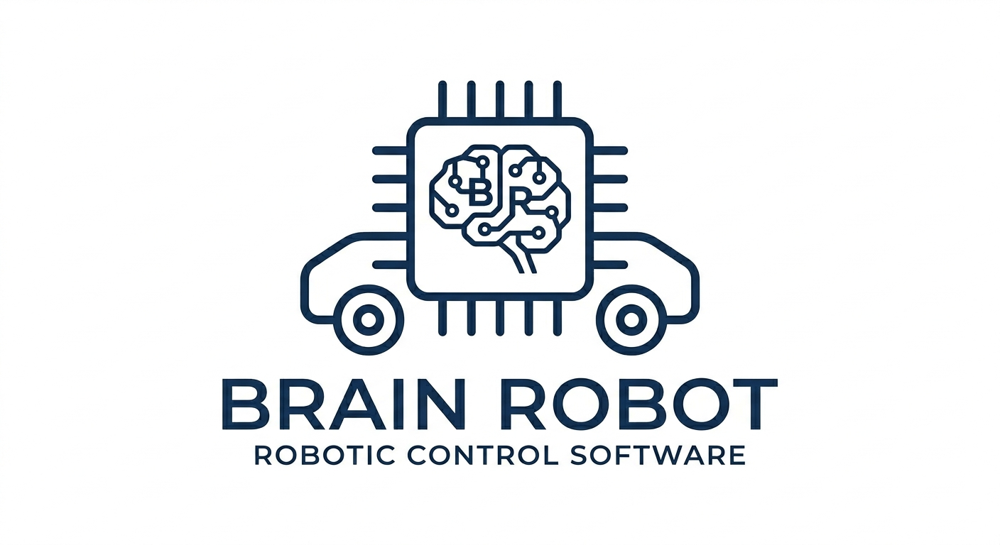

# BRAIN ROBOT




## Introduction

Brain Robot est une architecture logicielle embarquée dédiée au contrôle de robots mobiles via Bluetooth Low Energy (BLE). Le système repose sur une gestion optimisée du flux UART par pile circulaire, garantissant une communication fluide entre l'application mobile et le microcontrôleur. Il intègre une fusion de données issues d'une centrale inertielle MPU6050 et d'un capteur ultrasonique HC-SR04 pour la navigation et l'évitement d'obstacles.

## 🛰️ Structure Électronique

Le flux de données suit ce parcours entre l'utilisateur et la partie mécanique :

Contrôle (Downlink) : > 📱 MOBILE ─── Bluetooth ───> 🔵 [BLE] ─── UART ───> 🤖 Arduino ─── PWM ───> ⚙️ Moteurs

Retour d'état (Uplink) : > ⚙️ SENSORS ─── Feedback ───> 🤖 Arduino ─── UART ───> 🔵 [BLE] ─── Data ───> 📱 Mobile

## Algorithme

- PID pour controle moteur.
- Algorithme de Navigation Inertiel
- Buffer circulaire pour UART

## 📂 Structure du Projet

```text
Brain-Robot/
├── pictures/                  # Images, logos et diagrammes pour le README
│   
├── docs/                    # Documentation détaillée et schémas de câblage  
│   
├── src/                     # Code source (Firmware Arduino)
│   └── main.cpp # Point d'entrée
│
├── libs/ # Bibliothèques spécifiques si nécessaires
│    ├── algo/  # Fichier contenant les algorithmes (navigation, controle, Communication)
│    ├── control/     controle moteur
│    └── sensor /     dossier capteurs
│
├── Notes.md # Features a faire              
└── README.md
```

## SOURCES

La plupart des sources sont dans le dossier doc.
